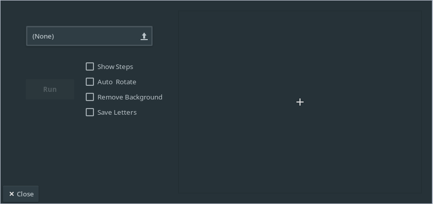
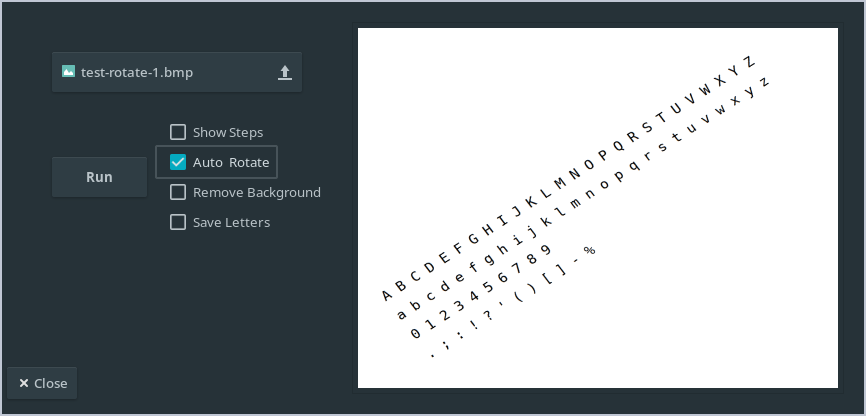
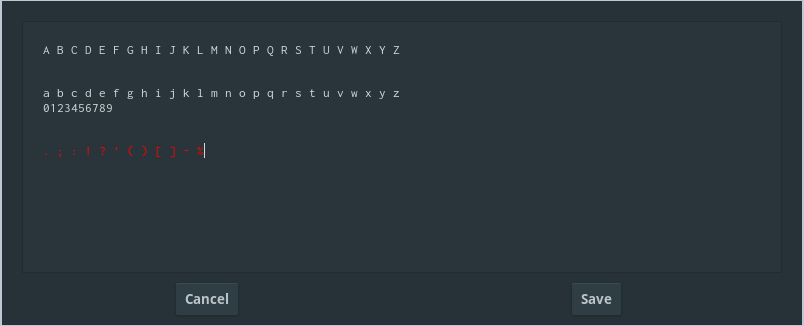

#  JustReadIT

JustReadIT is a text recognition tool developed as part of EPITA's 3rd semester project. 
The project specifications can be found [here](documents.md#specifications).

This software allows you to extract a text from an image. It has 4 processes allowing a better use :

- See the steps for decomposing and reading the image.

- Find the right angle to rotate the image to put it in the right angle.

- Removes the background from an image to make the text more readable.

- Saves the letters of the text separately to be able to start learning the neural network.

## Screenshots

### Home screen of the application

### Application with a selected image

### Result of reading an image

## Authors

JustReadIT is a project by : 

- [Quentin BRIOLANT](https://github.com/gastbob40)

- [Damien Champeyroux](https://github.com/rotdams/)

- [Sami BEYHUM](https://github.com/cessarlemur)

- [Adrien BARENS](https://github.com/AdrienBarens)

[//]: <> (> test) 
[//]: <> (?> this value) 
[//]: <> (!> test) 

